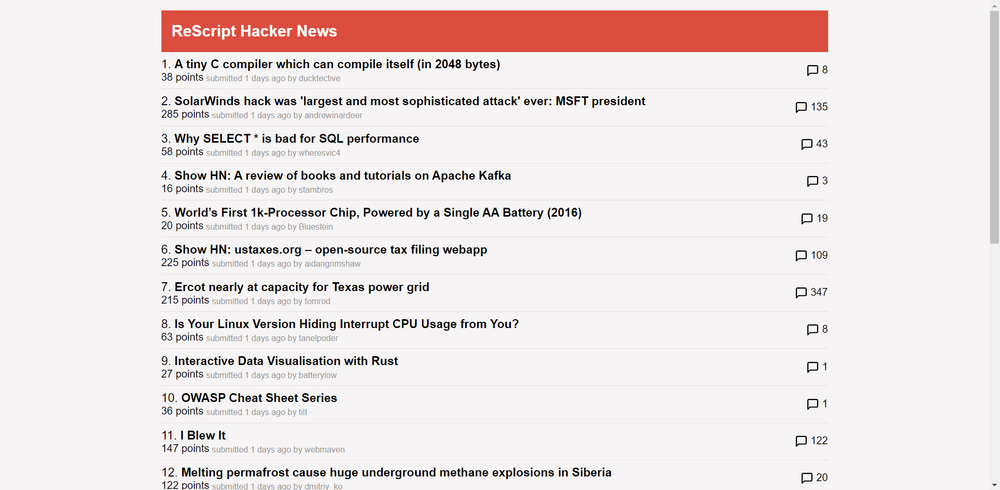

# ReScript Hacker New

Hacker news client built with [ReScript](https://rescript-lang.org) and [react](https://reactjs.org)

## Building

### Requirements:

- `node` and `yarn` installed on your system

### How to build (prod)

- Clone the repo
- `cd` into the cloned folder
- Run `yarn install`
- Run `yarn build`

### How to build (dev, with hot reload)

- Clone the repo
- `cd` into the cloned folder
- Run `yarn install`
- Run `yarn start:res` in one terminal and `yarn start:cra` in another
- After some time, the live server will be available at `localhost:3000`

## Screenshot

